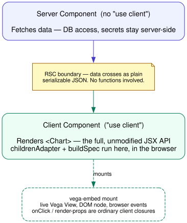

# Using react-spectrum-charts-s2 with React Server Components

> "RSC" below means **React Server Components**. This codebase's own `Rsc`-prefixed naming
> (`RscChart.tsx`, `rscToSbAdapter`) means "React Spectrum Charts" — unrelated.

Charts render through `vega-embed`, which mounts a live Vega `View` to a real DOM node and
drives it with browser events — there's no server-side equivalent that preserves interactivity.
And any interactive callback (`onClick`, a `ChartPopover` render-prop) is arbitrary code the
consumer writes, which only ever makes sense running in the browser where the click happens. So
the chart itself — marks, interactivity, popovers — stays in a Client Component, unchanged from
how you'd use this library without RSC at all. The only thing that moves to the server is
fetching the data.

## Pattern



**Server Component** — fetch data, nothing else:

```tsx
// app/page.tsx
import { Suspense } from 'react';
import { ChartSkeleton } from '@/components/ChartSkeleton';
import { getMockChartData } from '@/lib/mockData';
import { DynamicChartClient } from './DynamicChartClient';

export const dynamic = 'force-dynamic';

async function ChartSection() {
  const data = await getMockChartData();
  return <DynamicChartClient data={data} />;
}

export default function Page() {
  return (
    <Suspense fallback={<ChartSkeleton />}>
      <ChartSection />
    </Suspense>
  );
}
```

**Dynamic wrapper** — optional, defers the chart bundle out of the initial route chunk:

```tsx
// app/DynamicChartClient.tsx
'use client';
import dynamic from 'next/dynamic';

export const DynamicChartClient = dynamic(() => import('./ChartClient').then((m) => m.ChartClient));
```

**Client Component** — the chart, full API, real callbacks:

```tsx
// app/ChartClient.tsx
'use client';
import { Axis, Chart, ChartPopover, Legend, Line } from '@spectrum-charts/react-spectrum-charts-s2';
import { ChartDatum } from '@/lib/mockData';

export function ChartClient({ data }: { data: ChartDatum[] }) {
  return (
    <Chart data={data}>
      <Axis position="bottom" labelFormat="time" baseline />
      <Axis position="left" grid />
      <Line color="series" scaleType="time" dimension="datetime" metric="value">
        <ChartPopover>{(datum, close) => <MyPopoverContent datum={datum} onClose={close} />}</ChartPopover>
      </Line>
      <Legend highlight />
    </Chart>
  );
}
```

`data` is the only thing crossing the Server→Client boundary, as plain JSON. Everything else —
spec building, mark rendering, `onClick`, popovers, legend interactions — runs client-side,
unchanged.
